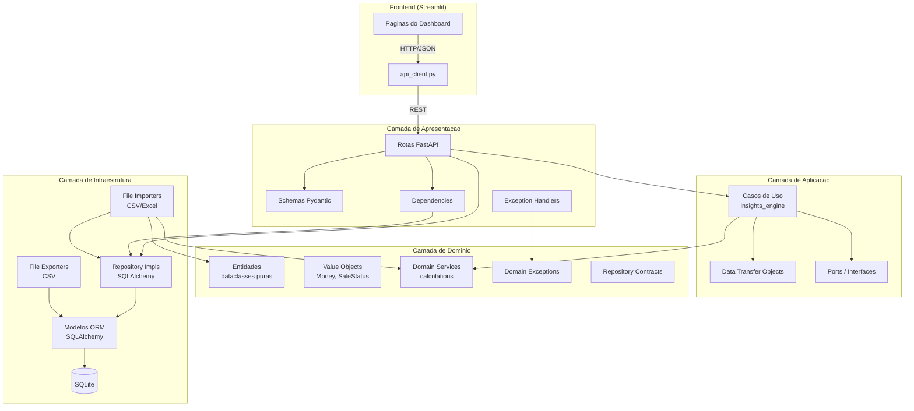

# Arquitetura do DoceVisao

Este documento descreve a arquitetura do sistema DoceVisao, as decisoes de projeto e as regras de organizacao do codigo.

---

## 1. Monolito vs. Microsservicos

O DoceVisao e intencionalmente um **monolito modular**, nao um sistema distribuido. A justificativa:

| Criterio | Monolito (escolhido) | Microsservicos |
|----------|---------------------|----------------|
| Escala do dominio | Uma doceria, um usuario | Exagero para o cenario |
| Complexidade operacional | Um processo, um banco | Orquestracao, rede, servicos |
| Tempo de desenvolvimento | Rapido, foco no valor | Lento, foco em infraestrutura |
| Deploy | Um container ou processo direto | Multiplas imagens, service mesh |
| Manutenibilidade | Camadas claras no mesmo repo | Contracts entre servicos |
| Custo | Zero infraestrutura extra | Servidores, message broker |

O sistema possui **uma unica base de codigo**, **um unico banco de dados** e **um unico processo de deploy**. A separacao em camadas internas garante que, se no futuro for necessario extrair um servico (ex: motor de insights), a migracao seja facilitada pelo baixo acoplamento.

## 2. Diagrama de Camadas



## 3. Responsabilidades de Cada Camada

### 3.1 Frontend (Streamlit)

- `frontend/app.py` — Pagina inicial com navegacao.
- `frontend/pages/` — Paginas do dashboard (Visao Geral, Produtos, Canais, Producao, Insights, Importacao, Indicadores).
- `frontend/services/api_client.py` — Cliente HTTP que consome todos os endpoints da API.
- `frontend/components/` — Componentes visuais reutilizaveis.
- `frontend/utils/` — Funcoes auxiliares de formatacao.

**Regra:** O frontend nunca acessa o banco diretamente. Toda comunicacao e via HTTP/JSON com o backend.

### 3.2 Camada de Apresentacao (`presentation/api/`)

- **Rotas** (`routes/`) — Endpoints FastAPI organizados por dominio (dashboard, sales, products, production, imports, exports, insights).
- **Schemas** (`schemas/`) — Modelos Pydantic para validacao de entrada e serializacao de saida.
- **Dependencies** (`dependencies.py`) — Factory functions para injecao de repositorios nas rotas.
- **Exception Handlers** (`exception_handlers.py`) — Mapeamento centralizado de excecoes de dominio para respostas HTTP.

**Regra:** Esta camada nao contem logica de negocio. Apenas recebe requisicoes, delega e formata respostas.

### 3.3 Camada de Aplicacao (`application/`)

- **DTOs** (`dto/`) — Objetos de transferencia de dados entre camadas (DashboardSummary, ProductRanking, ImportResult, etc.).
- **Ports** (`ports/`) — Interfaces abstratas para servicos externos.
- **Use Cases** (`use_cases/`) — Logica de orquestracao, como o motor de insights (`insights_engine.py`).

**Regra:** Esta camada depende apenas do dominio. Nao conhece SQLAlchemy, HTTP ou formatos de arquivo.

### 3.4 Camada de Dominio (`domain/`)

- **Entidades** (`entities/`) — Dataclasses Python puras (Product, SaleRecord, ProductionRecord, ImportBatch, etc.) sem dependencias de ORM.
- **Value Objects** (`value_objects/`) — Money (valores monetarios em centavos) e SaleStatus (normalizacao de status de venda).
- **Domain Services** (`services/`) — Funcoes puras de calculo (calculate_total_cents, calculate_margin, calculate_waste_rate, calculate_growth, etc.).
- **Exceptions** (`exceptions/`) — Excecoes de dominio (DuplicateImportError, InvalidSaleStatusError, NegativeValueError, etc.).
- **Repository Contracts** (`repositories/`) — Interfaces que os repositorios de infraestrutura devem implementar.

**Regra:** Esta camada e 100% Python puro. Zero dependencias externas (sem SQLAlchemy, sem FastAPI, sem Pandas).

### 3.5 Camada de Infraestrutura (`infrastructure/`)

- **Database** (`database/`) — Conexao SQLAlchemy (`connection.py`) e modelos ORM (`models.py`).
- **Repositories** (`repositories/`) — Implementacoes concretas dos repositorios usando SQLAlchemy.
- **Importers** (`importers/`) — Logica de parsing, validacao e persistencia de arquivos CSV/Excel.
- **Exporters** (`exporters/`) — Logica de geracao de arquivos de saida.

**Regra:** Esta camada implementa interfaces definidas pelo dominio e conhece detalhes tecnologicos (SQLAlchemy, Pandas, formatos de arquivo).

## 4. Fluxo de Importacao

O fluxo de importacao de dados segue o padrao **preview-then-confirm** em duas etapas:

```
Usuario                  Frontend              API                     Infraestrutura           Banco
  |                         |                    |                          |                      |
  |-- Upload arquivo ------>|                    |                          |                      |
  |                         |-- POST /preview -->|                          |                      |
  |                         |                    |-- read_upload() --------->|                      |
  |                         |                    |<-- DataFrame ------------|                      |
  |                         |                    |-- preview_sales() ------->|                      |
  |                         |                    |   (valida linha a linha)  |                      |
  |                         |                    |<-- ImportPreview --------|                      |
  |<-- Exibe preview -------|<-------------------|                          |                      |
  |                         |                    |                          |                      |
  |-- Confirma importacao ->|                    |                          |                      |
  |                         |-- POST /confirm -->|                          |                      |
  |                         |                    |-- compute_file_hash() -->|                      |
  |                         |                    |-- check_duplicate() ----->|--------------------->|
  |                         |                    |<-- (ok ou 409) ----------|<---------------------|
  |                         |                    |-- create_batch() -------->|--------------------->|
  |                         |                    |-- Para cada linha:        |                      |
  |                         |                    |   |-- parse + validate -->|                      |
  |                         |                    |   |-- get_or_create ----->|--------------------->|
  |                         |                    |   |   (product/date/     |                      |
  |                         |                    |   |    channel)          |                      |
  |                         |                    |   |-- add FactSale ----->|--------------------->|
  |                         |                    |-- finalize_batch() ------>|--------------------->|
  |                         |                    |-- commit ---------------->|--------------------->|
  |<-- Resultado ------------|<-------------------|                          |                      |
```

**Etapas detalhadas:**

1. **Upload** — O usuario envia um arquivo CSV ou Excel (max 50MB).
2. **Preview** — O arquivo e parseado e cada linha e validada individualmente. O resultado mostra quantas linhas sao validas/invalidas e os erros encontrados.
3. **Confirmacao** — O arquivo e re-enviado. O hash SHA-256 e calculado para detectar duplicatas. Um `ImportBatch` e criado com status "processing".
4. **Processamento** — Cada linha e parseada, dimensoes (produto, data, canal) sao criadas ou reutilizadas via `get_or_create`, e registros de fato sao inseridos.
5. **Finalizacao** — O batch e atualizado com contadores de aceitos/rejeitados e status "completed". Em caso de falha geral, status "failed" e rollback.
6. **Erros** — Linhas com erro sao registradas na tabela `import_errors` com detalhes da linha e mensagem.

## 5. Fluxo de Consulta

O fluxo de consulta (dashboard, KPIs, graficos) segue um padrao direto:

```
Frontend              API                     Repositorio              Banco de Dados
  |                    |                          |                         |
  |-- GET /summary --->|                          |                         |
  |   ?start_date=...  |-- build_filters() ------>|                         |
  |                    |-- get_summary(filters) ->|                         |
  |                    |                          |-- SQL com JOINs ------->|
  |                    |                          |<-- Row data ------------|
  |                    |                          |-- calculate_ticket()    |
  |                    |                          |-- calculate_growth()    |
  |                    |<-- DashboardSummary -----|                         |
  |<-- JSON response --|                          |                         |
```

**Etapas:**

1. **Filtros** — Query params (`start_date`, `end_date`, `product_id`, `category`, `channel_id`) sao convertidos em um objeto `SalesFilters`.
2. **Delegacao** — A rota delega ao repositorio apropriado (SalesRepository, ProductRepository, ProductionRepository).
3. **Consulta** — O repositorio monta uma query SQLAlchemy com JOINs entre fact tables e dim tables, aplicando filtros.
4. **Calculo** — Funcoes de dominio (calculate_ticket_medio, calculate_margin, calculate_growth) sao aplicadas sobre os resultados brutos.
5. **Resposta** — O DTO e convertido em schema Pydantic e retornado como JSON.

**Crescimento periodico:** Quando um filtro de data e fornecido, o sistema automaticamente calcula o faturamento do periodo anterior de mesma duracao e retorna o percentual de crescimento.

## 6. Regras de Direcao de Dependencias

As dependencias entre camadas seguem uma direcao estrita:

```
Frontend --> Presentation --> Application --> Domain
                                    |            ^
                                    v            |
                              Infrastructure ----+
```

**Regras:**

1. **Dominio nao depende de nada** — Entidades, value objects, services e exceptions sao Python puro.
2. **Application depende apenas do Domain** — DTOs e use cases conhecem apenas entidades e servicos de dominio.
3. **Presentation depende de Application e Infrastructure** — Rotas usam DTOs da aplicacao e repositorios da infraestrutura (via injecao).
4. **Infrastructure depende do Domain** — Implementacoes concretas realizam interfaces conceituais definidas pelo dominio.
5. **Frontend depende apenas da API** — Comunicacao exclusivamente via HTTP/JSON.

**Violar essas regras significa:** um import de `sqlalchemy` no dominio, um import de `fastapi` na aplicacao, ou acesso direto ao banco pelo frontend.

## 7. Modelo de Dados (Star Schema)

O banco segue o padrao **Star Schema** tipico de solucoes de BI:

- **Dimensoes** (tabelas de referencia): `dim_products`, `dim_dates`, `dim_channels`
- **Fatos** (tabelas de eventos): `fact_sales`, `fact_production`
- **Suporte** (tabelas operacionais): `import_batches`, `import_errors`

Dimensoes sao populadas automaticamente durante a importacao via `get_or_create`. A tabela `dim_dates` e populada sob demanda conforme novas datas aparecem nos dados importados.

## 8. Possibilidades de Evolucao

A arquitetura atual permite evoluir sem reescrita:

| Cenario | O que muda | O que permanece |
|---------|-----------|-----------------|
| Trocar SQLite por PostgreSQL | Apenas `DATABASE_URL` e driver | Toda a logica, queries, repositorios |
| Extrair motor de insights como servico | Criar API separada consumindo o mesmo DTO | Interface `generate_insights()` |
| Adicionar autenticacao | Middleware FastAPI + tabela users | Nenhuma rota precisa mudar |
| Substituir Streamlit por React | Novo frontend consumindo a mesma API | Todos os endpoints permanecem |
| Adicionar message broker para importacao assincrona | Celery/RQ na camada de infraestrutura | Domain e Application inalterados |
| Multi-tenancy | Campo `tenant_id` nas fact tables + filtro global | Estrutura de camadas preservada |

A separacao em camadas garante que mudancas tecnologicas (banco, framework web, frontend) sejam localizadas e nao exijam reescrita da logica de negocio.
